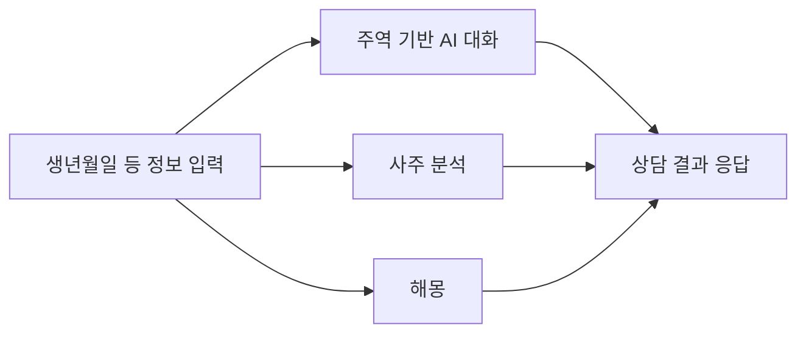

# Orient — 주역 & 사주 & 해몽

- App Store: [apps.apple.com](https://apps.apple.com/kr/app/orient-%EC%A3%BC%EC%97%AD-%EC%82%AC%EC%A3%BC-%ED%95%B4%EB%AA%BD/id6762338193)
- Google Play: [play.google.com](https://play.google.com/store/apps/details?id=com.orient.divination&hl=ko)
- 개인정보처리방침: [sanglimsoft.com/privacy/orient](https://sanglimsoft.com/privacy/orient/)
- 고객지원: [sanglimsoft.com/support](https://sanglimsoft.com/support/)

**Orient**는 주역(周易)을 기반으로 한 AI 대화와 사주(四柱) 분석을 함께 제공하는 AI 역학 상담 앱입니다. 생년월일 등 입력한 정보를 바탕으로 운세·분석 응답을 생성합니다.

## 어떻게 동작하나요

## 이런 분께 추천합니다

- 주역·사주에 관심 있지만 어디서부터 봐야 할지 막막한 분
- 대화하듯 편하게 운세를 물어보고 싶은 분

## 주요 기능

- 주역 기반 AI 대화 상담
- 사주 분석
- 해몽
