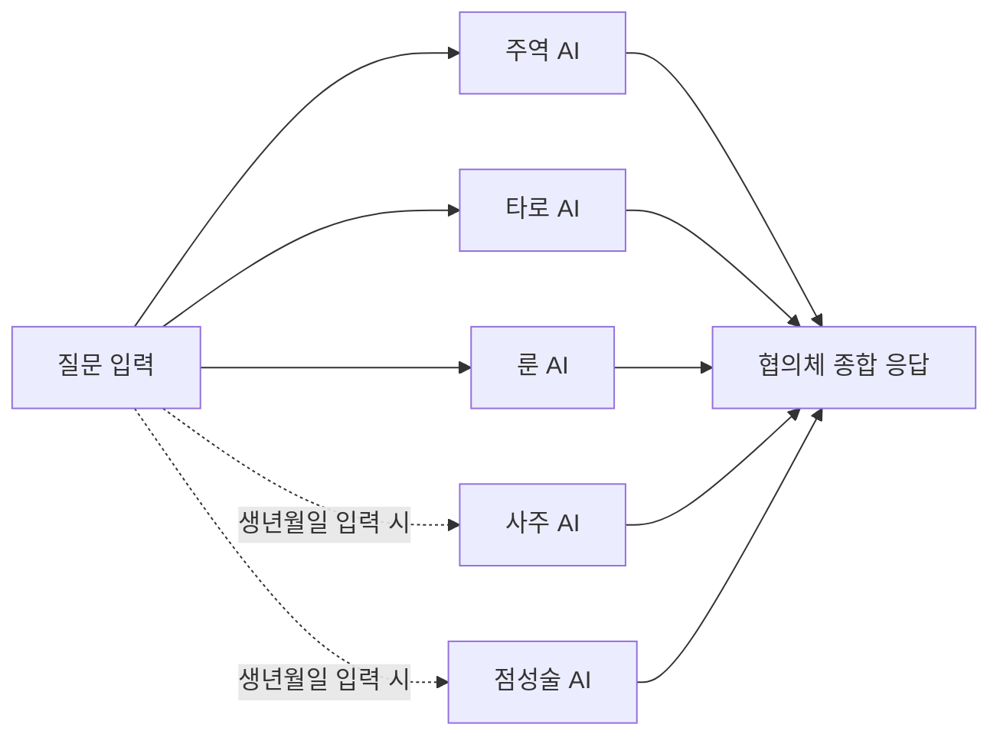
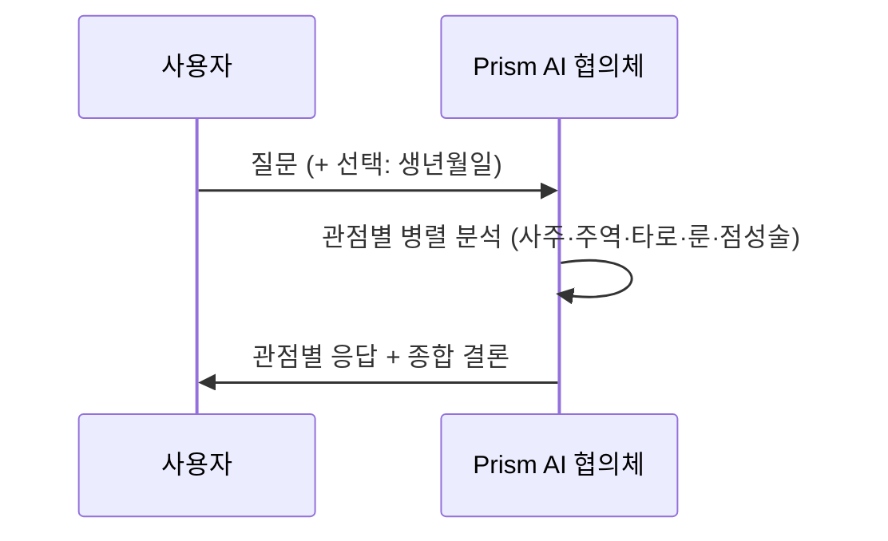

# Prism — 사주 · 주역 · 타로 · 룬 · 점성술 AI 협의체

- 웹사이트: [prism.sanglimsoft.com](https://prism.sanglimsoft.com/)
- App Store: [apps.apple.com](https://apps.apple.com/kr/app/orient-%EC%A3%BC%EC%97%AD-%EC%82%AC%EC%A3%BC-%ED%95%B4%EB%AA%BD/id6762338193)
- Google Play: [play.google.com](https://play.google.com/store/apps/details?id=com.orient.divination&hl=ko)
- 개인정보처리방침: [prism.sanglimsoft.com/privacy.html](https://prism.sanglimsoft.com/privacy.html)
- 고객지원: [prism.sanglimsoft.com/support.html](https://prism.sanglimsoft.com/support.html)

**Prism**은 사주·주역·타로·룬·점성술 다섯 관점이 하나의 질문에 함께 답하는 AI 협의체(council) 상담 앱입니다. 주역·타로·룬은 항상 실행되고, 생년월일을 입력하면 사주·점성술까지 추가로 참여해 최대 5관점이 종합 결론을 제시합니다.

## 어떻게 동작하나요

### 이용 흐름

## 이런 분께 추천합니다

- 하나의 질문을 여러 점술 체계로 동시에 비교해보고 싶은 분
- 대화하듯 편하게 운세를 물어보고 싶은 분

## 주요 기능

- 사주·주역·타로·룬·점성술 5관점 AI 협의체 대화
- 관점 간 종합 결론 제시
- 대화·괘 북마크
- 게스트(익명) 로그인 — 하루 10회 무료 메시지
- 7개 언어 지원 (한국어·영어·중국어·스페인어·러시아어·프랑스어·일본어)
